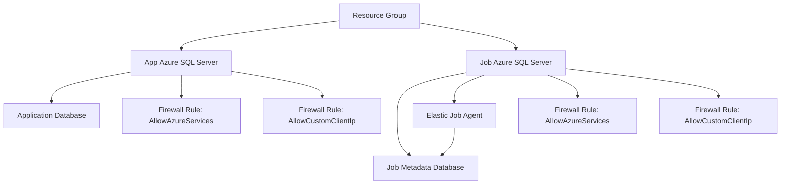

# Azure SQL Elastic Jobs Agent (Bicep)

Infrastructure-as-Code templates to provision an Azure SQL environment with an Elastic Job Agent using modular Bicep components.

## Overview

This deployment creates:

- Azure SQL logical server for application database (Entra-only authentication)
- Azure SQL logical server for Elastic Job metadata database (Entra-only authentication)
- Primary application database
- Elastic Job metadata database
- Azure SQL Elastic Job Agent
- Optional SQL firewall rules

## Architecture



## Repository Structure

- `deploy.sh`: Deploys using exported environment variables
- `post-deploy-target-group.sh`: Configures Elastic Job target groups and target members using the same environment variables as deployment
- `infra/main.bicep`: Deployment entry point and module orchestration
- `infra/modules/sql-server-sql-auth.bicep`: SQL-auth SQL logical server
- `infra/modules/sql-server-entra-auth.bicep`: Entra-auth (Entra-only) SQL logical server
- `infra/modules/sql-database.bicep`: Reusable SQL database module
- `infra/modules/sql-firewall-rule.bicep`: Reusable SQL firewall rule module
- `infra/modules/elastic-job-agent.bicep`: Elastic Job Agent
- `infra/main.parameters.json`: Example parameter values

```

## Prerequisites

- Azure subscription with permissions to deploy SQL resources
- Azure CLI installed and authenticated (`az login`)
- Existing or new resource group target

## Deployment

### Option 1: Deploy with exported environment variables (recommended)

1. Export required variables:

```bash
export RESOURCE_GROUP="rg-sql-jobs-dev"
export LOCATION="eastus"
export APP_SQL_SERVER_NAME="<globally-unique-app-sql-server-name>"
export JOB_SQL_SERVER_NAME="<globally-unique-job-sql-server-name>"
export ENTRA_ADMIN_LOGIN="<entra-admin-display-name>"
export ENTRA_ADMIN_OBJECT_ID="<entra-admin-object-id-guid>"
```

2. Export optional variables as needed:

```bash
export SQL_DATABASE_NAME="appdb"
export SQL_DATABASE_SKU_NAME="S0"
export SQL_DATABASE_SKU_TIER="Standard"
export JOB_DATABASE_NAME="jobdb"
export JOB_DATABASE_SKU_NAME="S1"
export JOB_DATABASE_SKU_TIER="Standard"
export ELASTIC_JOB_AGENT_NAME="elastic-job-agent"
export ALLOW_AZURE_SERVICES="true"
export CUSTOM_FIREWALL_START_IP=""
export CUSTOM_FIREWALL_END_IP=""
```

3. Run the deployment script:

```bash
./deploy.sh
```

The script validates required variables, ensures the resource group exists, and deploys `infra/main.bicep`.

## Post-Deployment: Configure Elastic Job Target Group

Elastic Job target groups are configured in the job database after infrastructure deployment.

Run the Bash-native script (uses your existing deployment environment variables):

```bash
./post-deploy-target-group.sh
```

By default, this script uses:
- `JOB_SQL_SERVER_NAME` as the Elastic Job Agent server
- `APP_SQL_SERVER_NAME` as the target server
- `ELASTIC_JOB_AGENT_NAME` as the agent name
- `RESOURCE_GROUP` as the resource group
- `TARGET_GROUP_NAME=serverGroup`
- `TARGET_MEMBERSHIP_TYPE=Include`

To target a single database instead of all databases on the app server:

```bash
export TARGET_GROUP_NAME="singleDbGroup"
export TARGET_DATABASE_NAME="${SQL_DATABASE_NAME:-appdb}"
./post-deploy-target-group.sh
```

Prerequisites:
- Azure CLI authenticated (`az login`)
- `python3` available in the shell environment

### Option 2: Deploy with parameter file

1. Update `infra/main.parameters.json`:
  - `appSqlServerName` and `jobSqlServerName` must be globally unique.
  - `entraAdminObjectId` must be a valid GUID value.
  - Optionally set `customFirewallStartIp` and `customFirewallEndIp`.

2. Create a resource group (if needed):

```bash
az group create --name <resource-group-name> --location <azure-region>
```

3. Deploy the templates:

```bash
az deployment group create \
  --resource-group <resource-group-name> \
  --template-file infra/main.bicep \
  --parameters @infra/main.parameters.json
```

## Key Parameters

- `appSqlServerName`: Application database logical server name (global uniqueness required)
- `jobSqlServerName`: Job metadata database logical server name (global uniqueness required)
- `entraAdminLogin` / `entraAdminObjectId`: Entra administrator identity for both SQL servers
- `sqlDatabaseName`: Application database name
- `jobDatabaseName`: Elastic Job metadata database name
- `elasticJobAgentName`: Elastic Job Agent resource name
- `allowAzureServices`: Creates `AllowAzureServices` firewall rule when `true`
- `customFirewallStartIp` / `customFirewallEndIp`: Creates `AllowCustomClientIp` when both are provided

For `deploy.sh`, these map to the following environment variables:

- `appSqlServerName` -> `APP_SQL_SERVER_NAME`
- `jobSqlServerName` -> `JOB_SQL_SERVER_NAME`
- `entraAdminLogin` -> `ENTRA_ADMIN_LOGIN`
- `entraAdminObjectId` -> `ENTRA_ADMIN_OBJECT_ID`
- `sqlDatabaseName` -> `SQL_DATABASE_NAME`
- `jobDatabaseName` -> `JOB_DATABASE_NAME`
- `elasticJobAgentName` -> `ELASTIC_JOB_AGENT_NAME`
- `allowAzureServices` -> `ALLOW_AZURE_SERVICES`
- `customFirewallStartIp` -> `CUSTOM_FIREWALL_START_IP`
- `customFirewallEndIp` -> `CUSTOM_FIREWALL_END_IP`

## Outputs

The deployment returns:

- App SQL server resource ID
- App SQL server fully qualified domain name
- Job SQL server resource ID
- Job SQL server fully qualified domain name
- Application database resource ID
- Job database resource ID
- Elastic Job Agent resource ID

## Operational Notes

- The Elastic Job Agent is bound to the job metadata database.
- Restrict firewall access to required IP ranges for production.
- Store secrets securely (for example, Azure Key Vault) instead of committing credentials.