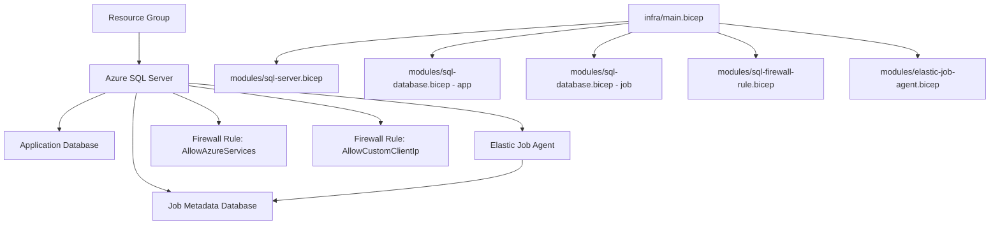

# Azure SQL Elastic Jobs Agent (Bicep)

Infrastructure-as-Code templates to provision an Azure SQL environment with an Elastic Job Agent using modular Bicep components.

## Overview

This deployment creates:

- Azure SQL logical server
- Primary application database
- Elastic Job metadata database
- Azure SQL Elastic Job Agent
- Optional SQL firewall rules

## Architecture



## Repository Structure

- `infra/main.bicep`: Deployment entry point and module orchestration
- `infra/modules/sql-server.bicep`: SQL logical server
- `infra/modules/sql-database.bicep`: Reusable SQL database module
- `infra/modules/sql-firewall-rule.bicep`: Reusable SQL firewall rule module
- `infra/modules/elastic-job-agent.bicep`: Elastic Job Agent
- `infra/main.parameters.json`: Example parameter values

## Prerequisites

- Azure subscription with permissions to deploy SQL resources
- Azure CLI installed and authenticated (`az login`)
- Existing or new resource group target

## Deployment

1. Update `infra/main.parameters.json`:
   - `sqlServerName` must be globally unique.
   - `sqlAdminPassword` must satisfy Azure SQL complexity requirements.
   - Optionally set `customFirewallStartIp` and `customFirewallEndIp`.

2. Create a resource group (if needed):

```bash
az group create --name <resource-group-name> --location <azure-region>
```

3. Deploy the templates:

```bash
az deployment group create \
  --resource-group <resource-group-name> \
  --template-file infra/main.bicep \
  --parameters @infra/main.parameters.json
```

## Key Parameters

- `sqlServerName`: Logical server name (global uniqueness required)
- `sqlAdminLogin` / `sqlAdminPassword`: SQL administrator credentials
- `sqlDatabaseName`: Application database name
- `jobDatabaseName`: Elastic Job metadata database name
- `elasticJobAgentName`: Elastic Job Agent resource name
- `allowAzureServices`: Creates `AllowAzureServices` firewall rule when `true`
- `customFirewallStartIp` / `customFirewallEndIp`: Creates `AllowCustomClientIp` when both are provided

## Outputs

The deployment returns:

- SQL server resource ID
- SQL server fully qualified domain name
- Application database resource ID
- Job database resource ID
- Elastic Job Agent resource ID

## Operational Notes

- The Elastic Job Agent is bound to the job metadata database.
- Restrict firewall access to required IP ranges for production.
- Store secrets securely (for example, Azure Key Vault) instead of committing credentials.